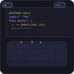

<!-- Premium GitHub.... Profile README.md for KalaiScript -->

<p align="center">
  
</p>

<!-- 1. Hero Banner -->
<p align="center">
  
</p>

<!-- 2. Typing Animation -->
<p align="center">
  <a href="https://git.io/typing-svg">
    
  </a>
</p>

<!-- 3. Social Links -->
<p align="center">
  <a href="https://linkedin.com/in/kalaiscript" target="_blank">
    
  </a>
  <a href="mailto:kalaiwebxd07@gmail.com" target="_blank">
    
  </a>
  <a href="https://twitter.com/KalaiScript" target="_blank">
    
  </a>
</p>


---

<!-- 4. About Me -->
## 🧑‍💻 About Me

```bash
$ cat developer_profile.json
{
  "name": "Kalaiyarasan",
  "alias": "KalaiScript",
  "role": "Full Stack Developer",
  "passion": "Designing high-performance backend systems and automation workflows",
  "focus": ["Microservices (gRPC)", "Cloud Infrastructure (Kubernetes)", "Event-Driven Systems"],
  "hobbies": ["Open Source Contributions", "Learning new tech stacks", "Mentoring"]
}
```

<table border="0" width="100%" cellpadding="0" cellspacing="0">
  <tr>
    <td width="60%" valign="top" style="border: none;">
      <ul>
        <li>👋 Hello! I'm <b>Kalaiyarasan</b>, a passionate... software engineer specializing in building robust, scalable applications.</li>
        <li>🔭 I'm currently working on open-source packages and developer productivity tools.</li>
        <li>⚡ I believe in writing self-documenting, clean and testable code.</li>
        <li>📫 How to reach me: <b>kalaiwebxd07@gmail.com</b> or via the social links above.</li>
      </ul>
    </td>
    <td width="40%" align="center" valign="middle" style="border: none;">
      
    </td>
  </tr>
</table>

---

<!-- 5. Tech Stack -->
## 🛠️ Tech Stack

### Languages & Backend
<table border="0" cellpadding="8" cellspacing="0">
  <tr>
    <td align="center" valign="top" style="border: none;">
      <a href="https://go.dev/" target="_blank">
        
      </a>
      <br /><sub><b>Go</b></sub>
    </td>
    <td align="center" valign="top" style="border: none;">
      <a href="https://developer.mozilla.org/en-US/docs/Web/JavaScript" target="_blank">
        
      </a>
      <br /><sub><b>JavaScript</b></sub>
    </td>
    <td align="center" valign="top" style="border: none;">
      <a href="https://www.typescriptlang.org/" target="_blank">
        
      </a>
      <br /><sub><b>TypeScript</b></sub>
    </td>
    <td align="center" valign="top" style="border: none;">
      <a href="https://www.python.org/" target="_blank">
        
      </a>
      <br /><sub><b>Python</b></sub>
    </td>
    <td align="center" valign="top" style="border: none;">
      <a href="https://nodejs.org/" target="_blank">
        
      </a>
      <br /><sub><b>Node.js</b></sub>
    </td>
    <td align="center" valign="top" style="border: none;">
      <a href="https://grpc.io/" target="_blank">
        
      </a>
      <br /><sub><b>gRPC</b></sub>
    </td>
    <td align="center" valign="top" style="border: none;">
      <a href="https://kafka.apache.org/" target="_blank">
        
      </a>
      <br /><sub><b>Kafka</b></sub>
    </td>
  </tr>
</table>

### Databases & Cloud DevOps
<table border="0" cellpadding="8" cellspacing="0">
  <tr>
    <td align="center" valign="top" style="border: none;">
      <a href="https://www.postgresql.org/" target="_blank">
        
      </a>
      <br /><sub><b>PostgreSQL.</b></sub>
    </td>
    <td align="center" valign="top" style="border: none;">
      <a href="https://www.mysql.com/" target="_blank">
        
      </a>
      <br /><sub><b>MySQL.</b></sub>
    </td>
    <td align="center" valign="top" style="border: none;">
      <a href="https://redis.io/" target="_blank">
        
      </a>
      <br /><sub><b>Redis.</b></sub>
    </td>
    <td align="center" valign="top" style="border: none;">
      <a href="https://www.docker.com/" target="_blank">
        
      </a>
      <br /><sub><b>Docker</b></sub>
    </td>
    <td align="center" valign="top" style="border: none;">
      <a href="https://kubernetes.io/" target="_blank">
        
      </a>
      <br /><sub><b>Kubernetess</b></sub>
    </td>
    <td align="center" valign="top" style="border: none;">
      <a href="https://www.nginx.com/" target="_blank">
        
      </a>
      <br /><sub><b>NGINX</b></sub>
    </td>
    <td align="center" valign="top" style="border: none;">
      <a href="https://www.jenkins.io/" target="_blank">
        
      </a>
      <br /><sub><b>Jenkins</b></sub>
    </td>
  </tr>
</table>

### Frontend & Design Tools
<table border="0" cellpadding="8" cellspacing="0">
  <tr>
    <td align="center" valign="top" style="border: none;">
      <a href="https://react.dev/" target="_blank">
        
      </a>
      <br /><sub><b>React</b></sub>
    </td>
    <td align="center" valign="top" style="border: none;">
      <a href="https://nextjs.org/" target="_blank">
        
      </a>
      <br /><sub><b>Next.js</b></sub>
    </td>
    <td align="center" valign="top" style="border: none;">
      <a href="https://www.adobe.com/products/photoshop.html" target="_blank">
        
      </a>
      <br /><sub><b>Photoshop</b></sub>
    </td>
    <td align="center" valign="top" style="border: none;">
      <a href="https://www.adobe.com/products/illustrator.html" target="_blank">
        
      </a>
      <br /><sub><b>Illustrator</b></sub>
    </td>
    <td align="center" valign="top" style="border: none;">
      <a href="https://gulpjs.com/" target="_blank">
        
      </a>
      <br /><sub><b>Gulp</b></sub>
    </td>
    <td align="center" valign="top" style="border: none;">
      <a href="https://www.npmjs.com/" target="_blank">
        
      </a>
      <br /><sub><b>NPM</b></sub>
    </td>
  </tr>
</table>

---

<!-- Current Focus & Skills Progress -->
## ⚡ Current Focus & Skills Progresss

<table border="0" width="100%" cellpadding="0" cellspacing="0">
  <tr>
    <td width="48%" valign="top" style="border: none;">
      <h4>Backend & Microservices (Go / gRPC)</h4>
      <svg width="100%" height="12">
        <rect width="100%" height="12" rx="6" ry="6" fill="#24283b" />
        <rect width="92%" height="12" rx="6" ry="6" fill="#38BDF8" />
      </svg>
      <br/><br/>
      <h4>Cloud Native & DevOps (Kubernetes/Docker)</h4>
      <svg width="100%" height="12">
        <rect width="100%" height="12" rx="6" ry="6" fill="#24283b" />
        <rect width="78%" height="12" rx="6" ry="6" fill="#9ece6a" />
      </svg>
    </td>
    <td width="4%" style="border: none;"></td>
    <td width="48%" valign="top" style="border: none;">
      <h4>Event-Driven Systems (Kafka)</h4>
      <svg width="100%" height="12">
        <rect width="100%" height="12" rx="6" ry="6" fill="#24283b" />
        <rect width="85%" height="12" rx="6" ry="6" fill="#bb9af7" />
      </svg>
      <br/><br/>
      <h4>Systems Design & Architecture</h4>
      <svg width="100%" height="12">
        <rect width="100%" height="12" rx="6" ry="6" fill="#24283b" />
        <rect width="80%" height="12" rx="6" ry="6" fill="#ff9e64" />
      </svg>
    </td>
  </tr>
</table>

---

<!-- DevOps Pipeline -->
## 🔄 Automated DevOps CI/CD Pipeline...

<p align="center">
  
</p>

---

<!-- 6 & 7. GitHub Stats & Streak::: -->
## 📊 GitHub Analytics.....

<table border="0" width="100%" cellpadding="0" cellspacing="0">
  <tr>
    <td width="48%" align="center" valign="middle" style="border: none;">
      <a href="https://github.com/KalaiScript">
        
      </a>
    </td>
    <td width="4%" style="border: none;"></td>
    <td width="48%" align="center" valign="middle" style="border: none;">
      <a href="https://github.com/KalaiScript">
        
      </a>
    </td>
  </tr>
</table>

<br/>

<table border="0" width="100%" cellpadding="0" cellspacing="0">
  <tr>
    <td align="center" valign="middle" style="border: none;">
      <a href="https://github.com/KalaiScript">
        
      </a>
    </td>
  </tr>
</table>

<!-- 9. Contribution Graph -->
## 📈 Contribution Graph

<p align="center">
  
</p>

<!-- 11. Contribution Snake -->
## 🐍 Contribution Snake

<p align="center">
  <picture>
    <source media="(prefers-color-scheme: dark)" srcset="https://raw.githubusercontent.com/KalaiScript/KalaiScript/output/github-contribution-grid-snake-dark.svg">
    <source media="(prefers-color-scheme: light)" srcset="https://raw.githubusercontent.com/KalaiScript/KalaiScript/output/github-contribution-grid-snake.svg">
    
  </picture>
</p>

---

<!-- 12. Featured Projects -->
## 📂 Featured Projects

<p align="center">
  <a href="https://github.com/KalaiScript/LinkedAudit">
    
  </a>
  <a href="https://github.com/KalaiScript/Pyrynx">
    
  </a>
</p>

<p align="center">
  <a href="https://github.com/KalaiScript/AI-CareerForge">
    
  </a>
  <a href="https://github.com/KalaiScript/All-semester-CGPA-calculator">
    
  </a>
</p>

---

<!-- 13. Achievements -->
## 🥇 Achievements

<table border="0" width="100%" cellpadding="0" cellspacing="0">
  <tr>
    <td width="65%" valign="top" style="border: none;">
      <ul>
        <li>🏆 <b>Top Contributor</b>: Actively building & maintaining microservices tooling.</li>
        <li>🦈 <b>Pull Shark</b>: Merged several complex PRs across distributed codebases.</li>
        <li>🎯 <b>Quickdraw</b>: Swift responder to issues and feedback cycles.</li>
        <li>⚡ <b>Hackathon Finalist</b>: Completed the GraphRAG Inference Hackathon build.</li>
      </ul>
    </td>
    <td width="35%" align="center" valign="middle" style="border: none;">
      
    </td>
  </tr>
</table>

---

<!-- 14. Certifications -->
## 📜 Certifications

<table border="0" width="100%" cellpadding="0" cellspacing="0">
  <tr>
    <td width="65%" valign="top" style="border: none;">
      <ul>
        <li>🏷️ <b>Google Cloud Digital Leader</b> — Google Cloud</li>
        <li>🏷️ <b>AWS Certified Solutions Architect (Associate)</b> — Amazon Web Services</li>
        <li>🏷️ <b>HashiCorp Certified: Terraform Associate</b> — HashiCorp</li>
        <li>🏷️ <b>Advanced Go Programming Patterns</b> — Tech Academy</li>
      </ul>
    </td>
    <td width="35%" align="center" valign="middle" style="border: none;">
      
    </td>
  </tr>
</table>

---

<!-- 17. Coding Profiles -->
## 🏆 Competitive Coding Profiles

<table border="0" width="100%" cellpadding="0" cellspacing="0">
  <tr>
    <td width="60%" valign="middle" style="border: none;">
      <p>Solving complex algorithmic challenges and optimizing data structures across platforms:</p>
      <br/>
      <p align="left">
        <a href="https://leetcode.com/kalai_script" target="_blank">
          
        </a>
        &nbsp;&nbsp;
        <a href="https://hackerrank.com/KalaiScript" target="_blank">
          
        </a>
        &nbsp;&nbsp;
        <a href="https://geeksforgeeks.org/" target="_blank">
          
        </a>
      </p>
    </td>
    <td width="40%" align="center" valign="middle" style="border: none;">
      
    </td>
  </tr>
</table>

---

<!-- 23. Contact -->
## ✉️ Get in Touch

<table border="0" width="100%" cellpadding="0" cellspacing="0">
  <tr>
    <td width="35%" align="center" valign="middle" style="border: none;">
      
    </td>
    <td width="65%" valign="middle" style="border: none;">
      <h3>Let's Connect & Collaborate!</h3>
      <p>Whether you want to discuss a project, need a developer, or just want to say hello, feel free to reach out:</p>
      <br/>
      <p align="left">
        <a href="mailto:kalaiwebxd07@gmail.com">
          
        </a>
        &nbsp;&nbsp;
        <a href="https://linkedin.com/in/kalaiyarasan" target="_blank">
          
        </a>
      </p>
    </td>
  </tr>
</table>

<br/>

<p align="center">
  <sub>Designed with ❤️ by <a href="https://github.com/KalaiScript">KalaiScript</a></sub>
</p>
