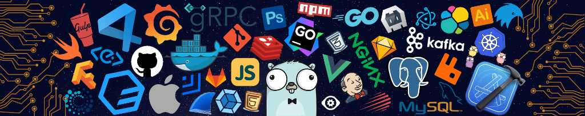
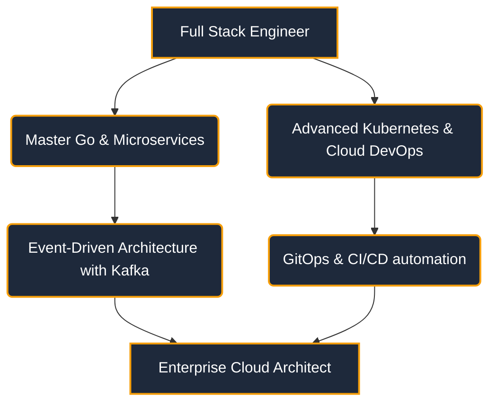

<!-- Premium GitHub Profile README.md for KalaiScript -->

<p align="center">
  <!-- Visitor Counter Badge -->
  
</p>

<!-- 1. Hero Banner -->
<p align="center">
  
</p>

<!-- 2. Typing Animation -->
<p align="center">
  <a href="https://git.io/typing-svg">
    
  </a>
</p>

<!-- 3. Social Links -->
<p align="center">
  <a href="https://linkedin.com/in/kalaiyarasan" target="_blank">
    
  </a>
  <a href="https://github.com/KalaiScript" target="_blank">
    
  </a>
  <a href="mailto:kalaiwebxd07@gmail.com" target="_blank">
    
  </a>
  <a href="https://twitter.com/KalaiScript" target="_blank">
    
  </a>
</p>

```text
████████████████████████████████████████████████████████████  ██╗  ██╗███████╗██╗     ██╗      ██████╗
████████████████████████████████████████████████████████████  ██║  ██║██╔════╝██║     ██║     ██╔═══██╗
███████████████████████████████████`.        ╙██████████████  ███████║█████╗  ██║     ██║     ██║   ██║
████████████████████████████████▀  ¿▓▓▓▓▓▓▓▓▄/ "████████████  ██╔══██║██╔══╝  ██║     ██║     ██║   ██║
██████████████████████████████▀.  ▓▓▓▓▓▓▓▓▓▓▓▓   ▐██████████  ██║  ██║███████╗███████╗███████╗╚██████╔╝▄█╗
██████████████████████████████ `  ▓▓▓▓▓▓▓▓▓▓▓▓  ` ██████████  ╚═╝  ╚═╝╚══════╝╚══════╝╚══════╝ ╚═════╝ ╚═╝
██████████████████████████████ `  ▓▓▓▓▓▓▓▓▓▓▓▓   ▄██████████
▀██████████████████████████████▌  ▀▀▓▓▓▓▓▓▓▌╓╖. ████████████  ███╗   ██╗██╗ ██████╗███████╗  ████████╗ ██████╗
█▄▀██████████████████████████████▄ ╩╦╙▀▀▀▀▀ ╣`,█████████████  ████╗  ██║██║██╔════╝██╔════╝  ╚══██╔══╝██╔═══██╗
▄▀█▄╙█████████████████████▀▀▀▀█████▄▄ .... ,▄███████▀███████  ██╔██╗ ██║██║██║     █████╗       ██║   ██║   ██║
██▄▀█▄╙█████████████████▀  ╪╢%╦══~╓,└ ╚▒▒▒ ╙▀|,╓╓═╤H   ▀████  ██║╚██╗██║██║██║     ██╔══╝       ██║   ██║   ██║
█▀▀▀-▀█▌▄▀█████████████   ║▒▒▒▒▒▒▒▒▒▒╢╦ ╘ -╣▒▒▒▒▒▒▒▒▒╢╕   ▀█  ██║ ╚████║██║╚██████╗███████╗     ██║   ╚██████╔╝
██▄▀██└║▄▄▄████████████▄          ═╕╕╕╕╕═╕═══════       ▄▄▄▄  ╚═╝  ╚═══╝╚═╝ ╚═════╝╚══════╝     ╚═╝    ╚═════╝
████▄▀█▌║███  ████████▌         ╕   ╩▒▒▒▒▒▒▒▒▒Ñ          ███
██████▌Ö▓▌   ▀██████████`╔▒▒╣ █ ▒▒m   ╚▒╢▒▒▒╩ -╣▒ ▌ ▒▒▒ ████  ███╗   ███╗███████╗███████╗████████╗  ██╗   ██╗ ██████╗ ██╗   ██╗
████ -"" ∞╙,▀.╙▀███████╜ ▒▒▒ ▄█ Ñ   -   S.  ═▒▒▒▒ █ ║▒▒╕└███  ████╗ ████║██╔════╝██╔════╝╚══██╔══╝  ╚██╗ ██╔╝██╔═══██╗██║   ██║
████████▄ -«   ∞▄.▀",╓═     ╒██   ═╣▒▒ `Ñ╛        █▌ ▒▒▒ ███  ██╔████╔██║█████╗  █████╗     ██║      ╚████╔╝ ██║   ██║██║   ██║
█████████▌ º     ╤╣▒╣╩^",▄▄███▀  ▒▒╣"     ''''''' ▀▀     `██  ██║╚██╔╝██║██╔══╝  ██╔══╝     ██║       ╚██╔╝  ██║   ██║██║   ██║
█████████  ▌       ▄▄████████─         ---------    L'▒▒▒ ██  ██║ ╚═╝ ██║███████╗███████╗   ██║        ██║   ╚██████╔╝╚██████╔╝
▀▀▀▀▀▀▀▀▀▀▀▀▀-     ▀▀▀▀▀▀▀▀▀▀       '╧╧╧╧╧╧╧╧╧`     ╚ ╧╧╧- ▀  ╚═╝     ╚═╝╚══════╝╚══════╝   ╚═╝        ╚═╝    ╚═════╝  ╚═════╝
```

---

<!-- 4. About Me -->
## 🧑‍💻 About Me

```bash
$ cat developer_profile.json
{
  "name": "Kalaiyarasan",
  "alias": "KalaiScript",
  "role": "Full Stack Developer",
  "passion": "Designing high-performance backend systems and automation workflows",
  "focus": ["Microservices (gRPC)", "Cloud Infrastructure (Kubernetes)", "Event-Driven Systems (Kafka)"],
  "hobbies": ["Open Source Contribution", "Learning new tech stacks", "Mentoring"]
}
```

*   👋 Hello! I'm **Kalaiyarasan**, a passionate software engineer specializing in building robust, scalable applications.
*   🔭 I'm currently working on open-source packages and developer productivity tools.
*   ⚡ I believe in writing self-documenting, clean, and testable code.
*   📫 How to reach me: **kalaiwebxd07@gmail.com** or via social links above.

---

<!-- 5. Tech Stack -->
## 🛠️ Tech Stack

### Languages & Backend
<table>
  <tr>
    <td align="center" width="100">
      <a href="https://go.dev/" target="_blank">
        
      </a>
      <br /><b>Go</b>
    </td>
    <td align="center" width="100">
      <a href="https://developer.mozilla.org/en-US/docs/Web/JavaScript" target="_blank">
        
      </a>
      <br /><b>JavaScript</b>
    </td>
    <td align="center" width="100">
      <a href="https://www.typescriptlang.org/" target="_blank">
        
      </a>
      <br /><b>TypeScript</b>
    </td>
    <td align="center" width="100">
      <a href="https://www.python.org/" target="_blank">
        
      </a>
      <br /><b>Python</b>
    </td>
    <td align="center" width="100">
      <a href="https://nodejs.org/" target="_blank">
        
      </a>
      <br /><b>Node.js</b>
    </td>
    <td align="center" width="100">
      <a href="https://grpc.io/" target="_blank">
        
      </a>
      <br /><b>gRPC</b>
    </td>
    <td align="center" width="100">
      <a href="https://kafka.apache.org/" target="_blank">
        
      </a>
      <br /><b>Kafka</b>
    </td>
  </tr>
</table>

### Databases & Cloud DevOps
<table>
  <tr>
    <td align="center" width="100">
      <a href="https://www.postgresql.org/" target="_blank">
        
      </a>
      <br /><b>PostgreSQL</b>
    </td>
    <td align="center" width="100">
      <a href="https://www.mysql.com/" target="_blank">
        
      </a>
      <br /><b>MySQL</b>
    </td>
    <td align="center" width="100">
      <a href="https://redis.io/" target="_blank">
        
      </a>
      <br /><b>Redis</b>
    </td>
    <td align="center" width="100">
      <a href="https://www.docker.com/" target="_blank">
        
      </a>
      <br /><b>Docker</b>
    </td>
    <td align="center" width="100">
      <a href="https://kubernetes.io/" target="_blank">
        
      </a>
      <br /><b>Kubernetes</b>
    </td>
    <td align="center" width="100">
      <a href="https://www.nginx.com/" target="_blank">
        
      </a>
      <br /><b>NGINX</b>
    </td>
    <td align="center" width="100">
      <a href="https://www.jenkins.io/" target="_blank">
        
      </a>
      <br /><b>Jenkins</b>
    </td>
  </tr>
</table>

### Frontend & Design Tools
<table>
  <tr>
    <td align="center" width="100">
      <a href="https://react.dev/" target="_blank">
        
      </a>
      <br /><b>React</b>
    </td>
    <td align="center" width="100">
      <a href="https://nextjs.org/" target="_blank">
        
      </a>
      <br /><b>Next.js</b>
    </td>
    <td align="center" width="100">
      <a href="https://www.adobe.com/products/photoshop.html" target="_blank">
        
      </a>
      <br /><b>Photoshop</b>
    </td>
    <td align="center" width="100">
      <a href="https://www.adobe.com/products/illustrator.html" target="_blank">
        
      </a>
      <br /><b>Illustrator</b>
    </td>
    <td align="center" width="100">
      <a href="https://gulpjs.com/" target="_blank">
        
      </a>
      <br /><b>Gulp</b>
    </td>
    <td align="center" width="100">
      <a href="https://www.npmjs.com/" target="_blank">
        
      </a>
      <br /><b>NPM</b>
    </td>
  </tr>
</table>

<p align="center">
  
</p>

<!-- 6 & 7. GitHub Stats & Streak -->
## 📊 GitHub Analytics

<table border="0" align="center" cellpadding="5" cellspacing="0">
  <tr>
    <td align="center" valign="middle">
      <a href="https://github.com/anuraghazra/github-readme-stats">
        
      </a>
    </td>
    <td align="center" valign="middle">
      
    </td>
  </tr>
  <tr>
    <td align="center" valign="middle">
      
    </td>
    <td align="center" valign="middle">
      <a href="https://github.com/denvercoder1/github-readme-streak-stats">
        
      </a>
    </td>
  </tr>
  <tr>
    <td align="center" valign="middle">
      <a href="https://github.com/anuraghazra/github-readme-stats">
        
      </a>
    </td>
    <td align="center" valign="middle">
      
    </td>
  </tr>
  <tr>
    <td align="center" valign="middle">
      
    </td>
    <td align="center" valign="middle">
      <a href="https://github.com/anuraghazra/github-readme-stats#wakatime-week-stats">
        
      </a>
    </td>
  </tr>
</table>

<br/>

<p align="center">
  
</p>

<!-- 9. Contribution Graph -->
## 📈 Contribution Graph

<p align="center">
  
</p>


<!-- 11. Contribution Snake -->
## 🐍 Contribution Snake

<p align="center">
  <picture>
    <source media="(prefers-color-scheme: dark)" srcset="https://raw.githubusercontent.com/KalaiScript/KalaiScript/output/github-contribution-grid-snake-dark.svg">
    <source media="(prefers-color-scheme: light)" srcset="https://raw.githubusercontent.com/KalaiScript/KalaiScript/output/github-contribution-grid-snake.svg">
    
  </picture>
</p>

---

<!-- 12. Featured Projects -->
## 📂 Featured Projects

<p align="center">
  <a href="https://github.com/KalaiScript/LinkedAudit">
    
  </a>
  <a href="https://github.com/KalaiScript/Pyrynx">
    
  </a>
</p>

<p align="center">
  <a href="https://github.com/KalaiScript/AI-CareerForge">
    
  </a>
  <a href="https://github.com/KalaiScript/All-semester-CGPA-calculator">
    
  </a>
</p>

---

<!-- 13. Achievements -->
## 🥇 Achievements

*   🏆 **Top Contributor**: Actively building & maintaining microservices tooling.
*   🦈 **Pull Shark**: Merged several complex PRs across distributed codebases.
*   🎯 **Quickdraw**: Swift responder to issues and feedback cycles.
*   ⚡ **Hackathon Finalist**: Completed the GraphRAG Inference Hackathon build.

---

<!-- 14. Certifications -->
## 📜 Certifications

- 🏷️ **Google Cloud Digital Leader** — Google Cloud
- 🏷️ **AWS Certified Solutions Architect (Associate)** — Amazon Web Services
- 🏷️ **HashiCorp Certified: Terraform Associate** — HashiCorp
- 🏷️ **Advanced Go Programming Patterns** — Tech Academy

---


<!-- 16. Roadmap -->
## 🗺️ Developer Roadmap



---

<!-- 17. Coding Profiles -->
## 🏆 Competitive Coding Profiles

<p align="center">
  <a href="https://leetcode.com/KalaiScript" target="_blank">
    
  </a>
  <a href="https://hackerrank.com/KalaiScript" target="_blank">
    
  </a>
  <a href="https://geeksforgeeks.org/" target="_blank">
    
  </a>
</p>

---


<!-- 20. WakaTime -->
## ⏱️ Weekly Coding Activity

<p align="center">
  <!-- Dynamic WakaTime Detail Chart (Bar graph) -->
  <a href="https://github.com/anuraghazra/github-readme-stats">
    
  </a>
</p>


<!-- 23. Contact -->
## ✉️ Get in Touch

<p align="center">
  <b>Want to collaborate or just say hello? Let's connect!</b>
</p>

<p align="center">
  <a href="mailto:kalaiwebxd07@gmail.com">
    
  </a>
  <a href="https://linkedin.com/in/kalaiyarasan" target="_blank">
    
  </a>
</p>

---

<!-- 24. Footer (Capsule Render / Wave Banner) -->
<p align="center">
  
</p>
